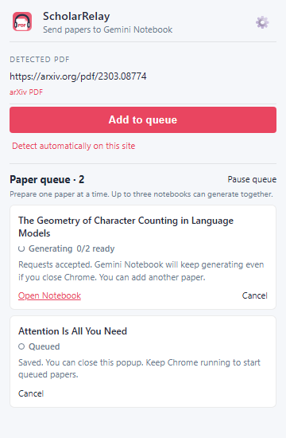
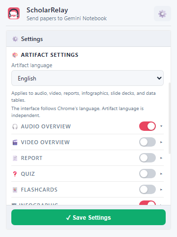

# ScholarRelay

Send a PDF, research paper, or webpage to Gemini Notebook (formerly NotebookLM), organize the notebook, and generate the artifacts you choose in one workflow.

[Install from the Chrome Web Store](https://chromewebstore.google.com/detail/epopghhfmpokhbalmnfcopmplffphdbb) · [Support](https://github.com/mahlernim/scholar-relay/issues) · [Privacy](./PRIVACY.md) · [한국어](#한국어) · [English](#english)

> ScholarRelay is an independent open-source extension and is not affiliated with, authorized by, or endorsed by Google. It uses your existing signed-in Gemini Notebook browser session and never asks for your Google password or verification code.

## Screenshots

| Workflow | Settings |
| --- | --- |
|  |  |

---

## 한국어

ScholarRelay는 PDF, 연구 논문 또는 웹페이지를 Gemini Notebook(이전 명칭 NotebookLM)으로 보내고, 노트북을 정리하고, 원하는 아티팩트를 생성하는 과정을 한 번에 처리합니다.

### 주요 기능

- 현재 탭에서 PDF, arXiv 논문, 웹페이지를 감지해 Gemini Notebook 소스로 추가합니다.
- HTML 메타데이터에서 논문 제목과 PDF 링크를 먼저 찾고 URL로 가져옵니다. 가져오기가 실패한 경우에만 PDF를 내려받아 업로드하며, 로컬 PDF도 지원합니다.
- 새 노트북을 선택한 기존 컬렉션에 자동으로 추가할 수 있습니다.
- 감지한 논문 제목을 우선 사용하거나 Gemini Notebook의 자동 제목 생성을 선택할 수 있습니다.
- 오디오, 비디오, 보고서, 퀴즈, 플래시카드, 인포그래픽, 슬라이드, 마인드맵, 데이터 표를 원하는 조합으로 생성합니다.
- 팝업을 닫아도 Chrome의 절전형 알람으로 진행 상태를 확인하며 완료 알림, 차임, 노트북 자동 열기를 설정할 수 있습니다.

### 설치

Chrome 120 이상과 Gemini Notebook에 로그인할 Google 계정이 필요합니다.

1. [Chrome 웹 스토어](https://chromewebstore.google.com/detail/epopghhfmpokhbalmnfcopmplffphdbb)에서 **Chrome에 추가**를 클릭합니다.
2. Chrome 도구 모음의 **확장 프로그램** 메뉴에서 ScholarRelay를 고정합니다.
3. [Gemini Notebook](https://notebook.google.com)에 로그인합니다.

스토어에서 설치한 확장 프로그램은 Chrome이 자동으로 업데이트합니다.

ZIP으로 수동 설치 및 업데이트

1. [최신 릴리스](https://github.com/mahlernim/scholar-relay/releases/latest)의 **Assets**에서 `scholar-relay-vX.Y.Z.zip`을 다운로드합니다. GitHub가 자동 제공하는 **Source code** ZIP은 설치용 파일이 아닙니다.
2. ZIP을 계속 사용할 폴더에 압축 해제합니다.
3. Chrome에서 `chrome://extensions`를 열고 **개발자 모드**를 켭니다.
4. **압축해제된 확장 프로그램을 로드**를 클릭하고 `manifest.json`이 들어 있는 폴더를 선택합니다.
5. [Gemini Notebook](https://notebook.google.com)에 로그인합니다.

새 릴리스 ZIP의 파일을 기존 확장 프로그램 폴더에 덮어쓴 다음 `chrome://extensions`에서 확장 프로그램의 **새로고침** 버튼을 클릭합니다. 같은 폴더를 사용하면 기존 설정이 유지됩니다.

수동 설치본에서 스토어 버전으로 전환할 때는 기존 설정을 확인해 두고, 수동 설치본을 사용 중지한 뒤 스토어 버전을 설치하세요. 설정은 자동으로 이전되지 않을 수 있습니다.

### 사용 방법

1. PDF, arXiv 논문 또는 웹페이지를 열고 ScholarRelay 아이콘을 클릭합니다.
2. 필요하면 **Settings**에서 노트북, 아티팩트, 사용 환경 설정을 조정합니다.
3. 감지된 소스를 사용하거나 로컬 PDF를 선택해 생성을 시작합니다.
4. 진행 상태를 확인하고 완료 후 **Open in Gemini Notebook**을 클릭합니다.

### 설정

| 영역 | 기능 |
| --- | --- |
| **Notebook Settings** | 새 노트북을 추가할 컬렉션과 감지한 논문 제목 사용 여부 |
| **Artifact Settings** | 아티팩트 선택, 형식, 길이, 언어, 스타일, 사용자 지침 |
| **Experience** | 데스크톱 알림, 완료 차임, 완료된 노트북 자동 열기 |

컬렉션 추가에 실패해도 소스 처리와 아티팩트 생성은 계속됩니다. 컬렉션 목록은 현재 로그인한 Gemini Notebook 계정에서 불러옵니다.

### 권한 및 문제 해결

- 현재 페이지와 다른 사이트에 있는 PDF를 직접 내려받아야 할 때만 해당 PDF 사이트에 대한 Chrome 권한을 요청합니다. URL 가져오기는 다운로드 권한 없이 먼저 시도하며, 업로드가 필요할 때만 권한을 요청합니다. 권한을 거부하면 파일을 직접 선택할 수 있습니다.
- 로컬 `file://` PDF를 읽으려면 확장 프로그램 세부정보에서 **파일 URL에 대한 액세스 허용**을 켜야 할 수 있습니다.
- 실행되지 않으면 [Gemini Notebook](https://notebook.google.com)에 로그인되어 있는지 확인하고 다시 시도합니다.
- 컬렉션이 보이지 않으면 Gemini Notebook에서 컬렉션을 만든 뒤 설정의 새로고침 버튼을 클릭합니다.
- PDF URL 가져오기나 처리 실패가 확인되면 같은 노트북에 PDF 업로드를 한 번 시도합니다. 다운로드 권한이 필요하면 팝업에서 허용하거나 PDF를 직접 선택하세요. 시간 초과나 결과가 불확실한 응답에서는 추가 업로드를 실행하지 않습니다.
- Chrome 메모리를 안전하게 유지하기 위해 직접 내려받기 및 로컬 업로드는 40 MiB로 제한됩니다. 더 큰 원격 PDF는 URL 가져오기를 사용하고, 더 큰 로컬 파일은 Gemini Notebook에서 직접 업로드합니다.

---

## English

### Highlights

- Detects PDFs, arXiv papers, and webpages in the current tab and adds them to Gemini Notebook.
- Reads paper titles and PDF links from HTML first, then imports the PDF URL. Downloads and uploads only after a confirmed import failure, with local PDF uploads also supported.
- Can automatically add each new notebook to a selected existing collection.
- Can prefer the detected paper title or let Gemini Notebook choose the notebook title.
- Generates any combination of audio, video, reports, quizzes, flashcards, infographics, slide decks, mind maps, and data tables.
- Uses Chrome's event-driven alarms to monitor progress after the popup closes, with optional notifications, a completion chime, and automatic notebook opening.

### Install

Requires Chrome 120 or newer and a Google account signed in to Gemini Notebook.

1. Visit the [Chrome Web Store](https://chromewebstore.google.com/detail/epopghhfmpokhbalmnfcopmplffphdbb) and click **Add to Chrome**.
2. Pin ScholarRelay from the **Extensions** menu in the Chrome toolbar.
3. Sign in to [Gemini Notebook](https://notebook.google.com).

Chrome automatically updates extensions installed from the store.

Manual ZIP installation and updates

1. Under **Assets** on the [latest release](https://github.com/mahlernim/scholar-relay/releases/latest), download `scholar-relay-vX.Y.Z.zip`. GitHub's automatically generated **Source code** archives are not install-ready extensions.
2. Extract the ZIP into a folder you will keep.
3. Open `chrome://extensions` and enable **Developer mode**.
4. Click **Load unpacked** and select the extracted folder containing `manifest.json`.
5. Sign in to [Gemini Notebook](https://notebook.google.com).

Extract the new release over the existing extension folder, then click the extension's **Reload** button on `chrome://extensions`. Reusing the same folder preserves your settings.

When switching from a manual installation to the store version, note your settings and disable the manual copy before installing from the store. Settings may not transfer automatically.

### Use

1. Open a PDF, arXiv paper, or webpage and click the ScholarRelay icon.
2. If needed, open **Settings** and configure notebook, artifact, and experience options.
3. Start with the detected source or choose a local PDF.
4. Follow progress and click **Open in Gemini Notebook** when complete.

### Settings

| Section | Controls |
| --- | --- |
| **Notebook Settings** | Destination collection and whether to prefer the detected paper title |
| **Artifact Settings** | Artifact selection, format, length, language, style, and custom instructions |
| **Experience** | Desktop notifications, completion chime, and automatic notebook opening |

Source processing and artifact generation continue if collection assignment fails. Collections are loaded from the currently signed-in Gemini Notebook account.

### Permissions and troubleshooting

- Chrome asks for access to a specific PDF website only when the PDF is hosted on a different site and must be downloaded directly. URL import is tried first without download access. If upload fallback needs permission, you can grant it or select the PDF manually.
- To read local `file://` PDFs, enable **Allow access to file URLs** in the extension's details.
- If a run does not start, confirm that you are signed in at [Gemini Notebook](https://notebook.google.com) and retry.
- If a collection is missing, create it in Gemini Notebook and use the refresh button in Settings.
- Confirmed PDF URL import or processing failures trigger one upload fallback in the same notebook. If download access is needed, reopen the popup to grant it or select the PDF manually. Timeouts and uncertain responses do not trigger another upload.
- Direct downloads and local uploads are limited to 40 MiB to keep Chrome memory use safe. Larger remote PDFs use URL import, while larger local files should be uploaded directly in Gemini Notebook.

## Credits and compatibility

The consumer integration was heavily informed by [`teng-lin/notebooklm-py`](https://github.com/teng-lin/notebooklm-py).

The consumer Gemini Notebook web application does not provide an official public API for this workflow. ScholarRelay uses unsupported internal web endpoints, so service changes may require compatibility updates.

[Developer notes](./docs/DEVELOPMENT.md) cover implementation decisions, release troubleshooting, and the Chrome Web Store submission history.

## License

MIT. See [LICENSE](./LICENSE).
